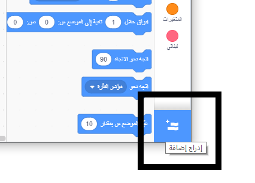

لاستخدام المقاطع الموسيقية في سكراتش (Scratch)، تحتاج إلى إدراج إضافة ** ملحق الموسيقا **.

+ اضغط على زر **إدراج إضافة** في الزاوية اليسرى السفلى.

+ انقر على امتداد ** الموسيقى ** لإضافته.

+ يظهر قسم الموسيقى في أسفل قائمة المقاطع.

