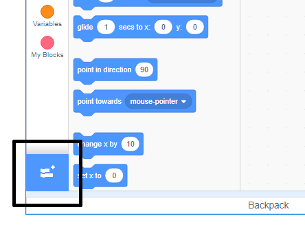

To use the Music blocks in Scratch, you need to add the **Music extension**.

+ Click on the **Add extension** button in the bottom left-hand corner.

+ Click on the **Music** extension to add it.

+ The Music section then appears at the bottom of the blocks menu.

***
Tento projekt byl přeložen dobrovolníky:

[name]

[name]

[name]

Díky dobrovolníkům můžeme dát lidem po celém světě šanci se učit ve svém vlastním jazyce. Můžete nám pomoci oslovit více lidí dobrovolným překládáním - více informací na [rpf.io/translate](https://rpf.io/translate).
