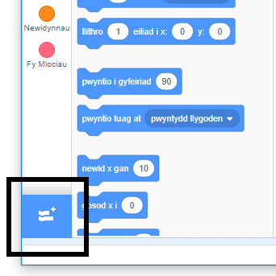
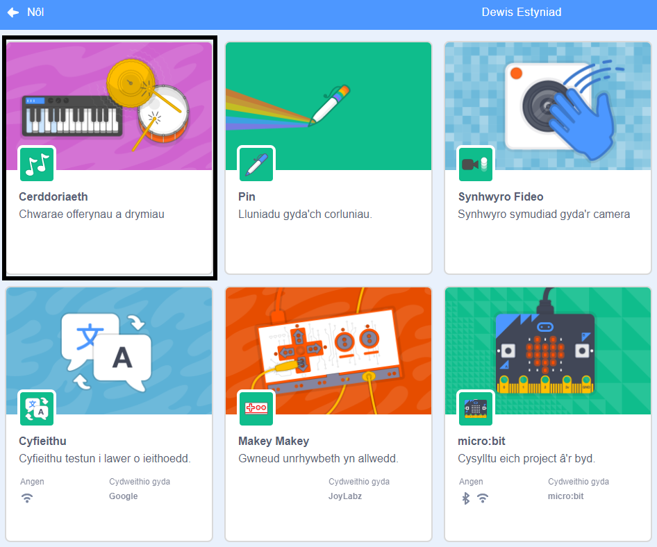
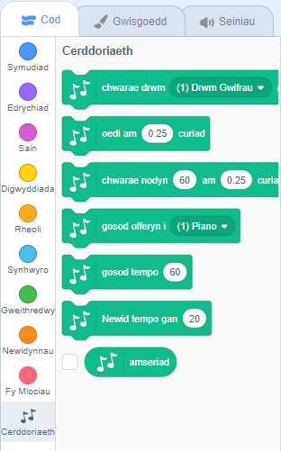

I ddefnyddio'r blociau Cerddoriaeth yn Scratch, mae angen i chi ychwanegu'r estyniad **Music**.

+ Clicia'r botwm **Ychwanegu Estyniad** yng ngwaelod-chwith y dudalen.

+ Clicia'r estyniad **Cerddoriaeth** i'w ychwanegu.

+ Yna mae'r adran Cerddoriaeth yn ymddangos ar waelod y ddewislen blociau.

