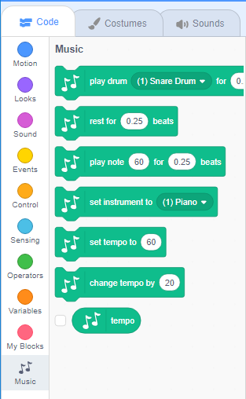

To use the Music blocks in Scratch, you need to add the **Music extension**.

+ Click on the **Add extension** button in the bottom left-hand corner.

+ Click on the **Music** extension to add it.

+ The Music section then appears at the bottom of the blocks menu.

***
Dette projekt blev oversat af frivillige:

[name]

[name]

[name]

Takket være frivillige kan vi give mennesker over hele verden chancen for at lære på deres eget sprog. Du kan hjælpe os med at nå endnu flere mennesker ved at melde dig som frivillig oversætter - få mere information på [rpf.io/translate](https://rpf.io/translate).
