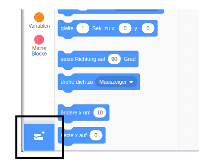
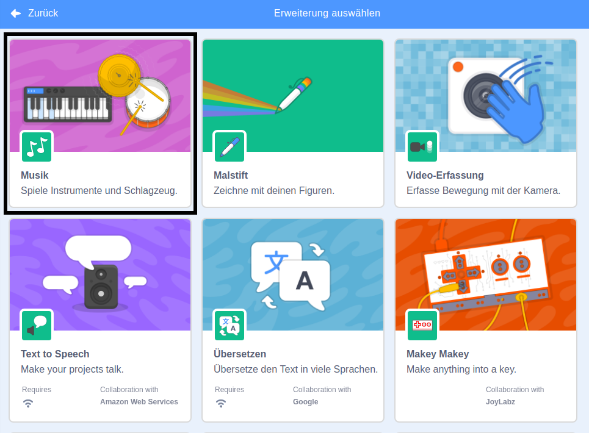
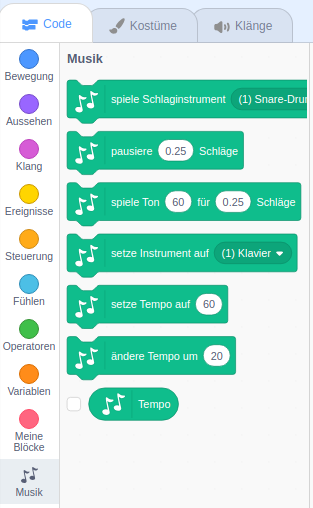

Um die Musikblöcke in Scratch zu verwenden, musst du die Erweiterung **Musik** hinzufügen.

+ Klicken Sie auf die Schaltfläche **Erweiterung hinzufügen** in der unteren linken Ecke.

+ Klicken Sie auf die Erweiterung **Musik**, um sie hinzuzufügen.

+ Der Musikbereich wird dann unten im Blockmenü angezeigt.

