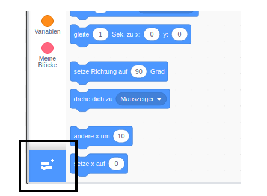
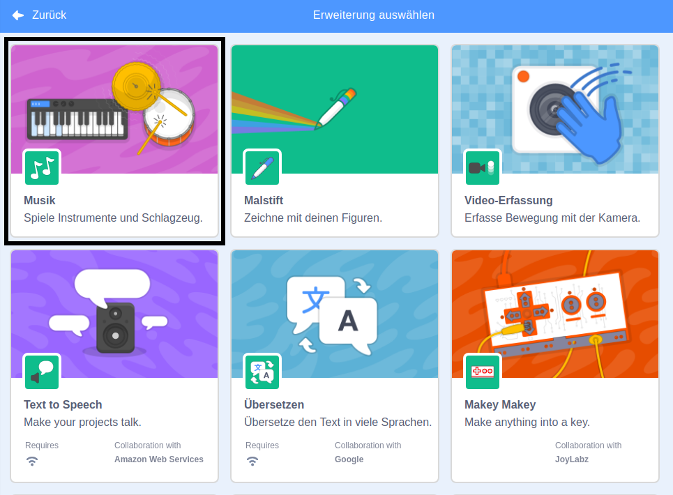

To use the Music blocks in Scratch, you need to add the **Music extension**.

+ Klicken Sie auf die Schaltfläche **Erweiterung hinzufügen** in der unteren linken Ecke.

+ Klicken Sie auf die Erweiterung **Musik**, um sie hinzuzufügen.

+ Der Musikbereich wird dann unten im Blockmenü angezeigt.

***
Dieses Projekt wurde von freiwilligen Helfern übersetzt:

[name]

[name]

[name]

Dank freiwilliger Helfer können wir Menschen auf der ganzen Welt die Möglichkeit geben, in ihrer eigenen Sprache zu lernen. Du kannst uns helfen, mehr Menschen zu erreichen, indem Du dich freiwillig zum Übersetzen meldest - weitere Informationen unter [rpf.io/translate](https://rpf.io/translate).
