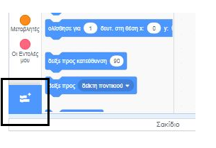
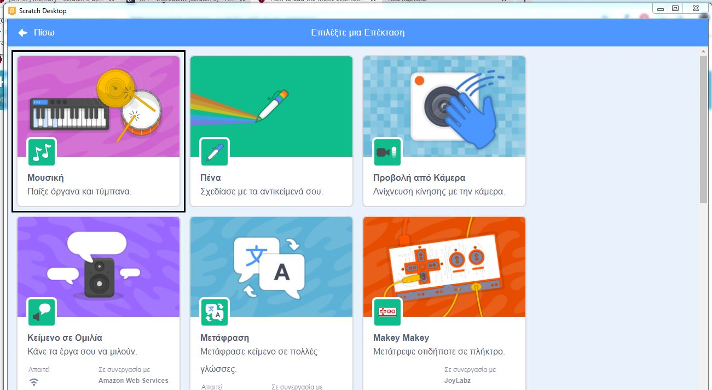
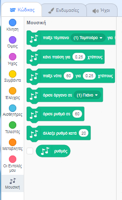

To use the Music blocks in Scratch, you need to add the **Music extension**.

+ Κάνε κλικ στην **Προσθήκη επέκτασης** στην κάτω αριστερή γωνία.

+ Κάνε κλικ στην επέκταση **"Μουσική"** για να την προσθέσεις.

+ Στη συνέχεια, η ενότητα "Μουσική" εμφανίζεται στο κάτω μέρος του μενού των μπλοκ.

