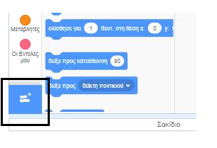

To use the Music blocks in Scratch, you need to add the **Music extension**.

+ Κάνε κλικ στην **Προσθήκη επέκτασης** στην κάτω αριστερή γωνία.

+ Κάνε κλικ στην επέκταση **"Μουσική"** για να την προσθέσεις.

+ Στη συνέχεια, η ενότητα "Μουσική" εμφανίζεται στο κάτω μέρος του μενού των μπλοκ.

***
Το έργο αυτό μεταφράστηκε από τους εθελοντές:

[name]

[name]

[name]

Χάρη στους εθελοντές, μπορούμε να δώσουμε σε ανθρώπους σε όλο τον κόσμο την ευκαιρία να μάθουν στη γλώσσα τους. Μπορείτε να μας βοηθήσετε να προσεγγίσουμε περισσότερους ανθρώπους μεταφράζοντας εθελοντικά - περισσότερες πληροφορίες στο [rpf.io/translate](https://rpf.io/translate).
