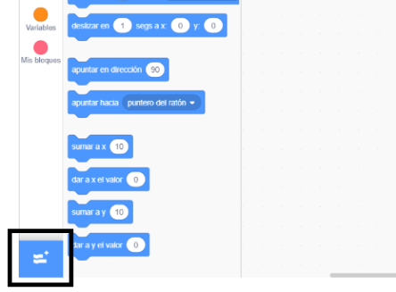
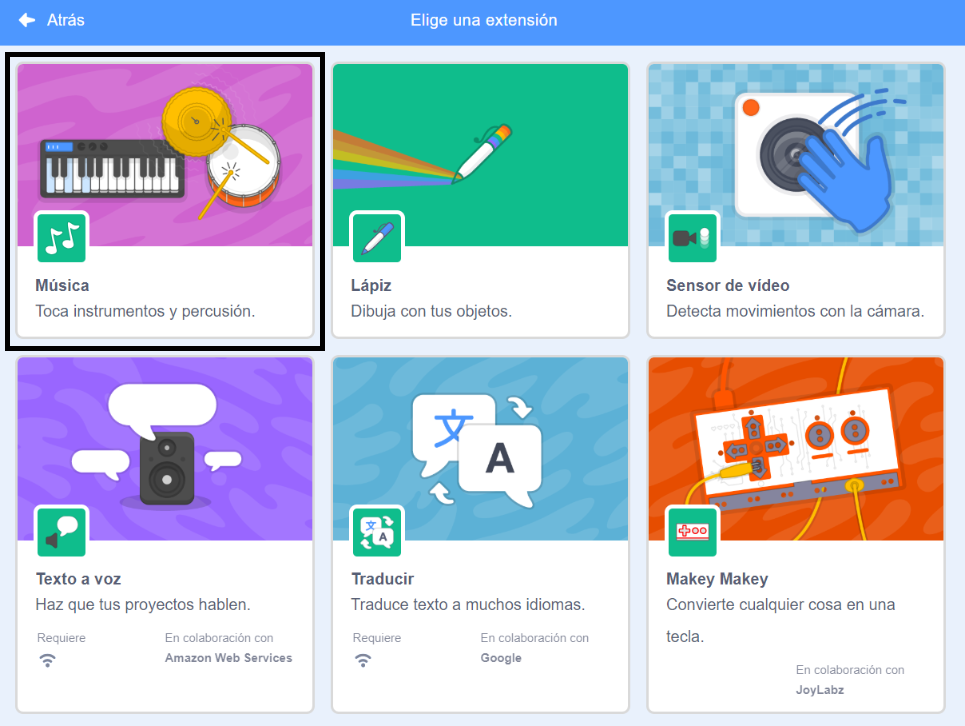
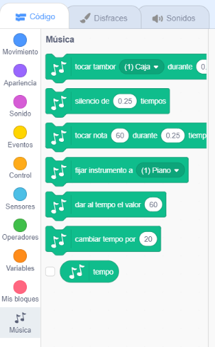

Para usar los bloques música en Scratch, necesitarás añadir la **Extensión Música**.

+ Haz click en el botón **Añadir Extensión** en la esquina inferior izquierda.

+ Haz click en la extensión **Música** para añadirla.

+ La sección Música aparecerá en la parte inferior del menú de bloques.

