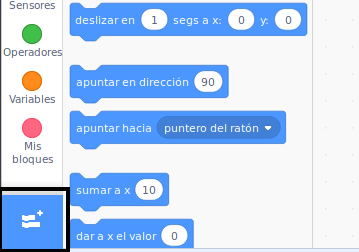
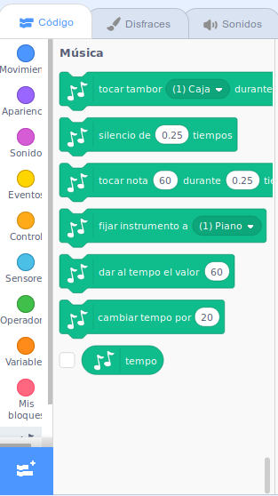

To use the Music blocks in Scratch, you need to add the **Music extension**.

+ Haz click en el botón **Agregar extensión** en la esquina inferior izquierda.

+ Haz click en la extensión **Música** para añadirla.

+ La sección Música aparecerá en la parte inferior del menú de bloques.

***
Este proyecto fue traducido por voluntarios:

[name]

[name]

[name]

Gracias a los voluntarios, podemos dar a las personas de todo el mundo la oportunidad de aprender en su propio idioma. Puedes ayudarnos a llegar a más personas ofreciéndote como voluntario para traducir. Más información en [rpf.io/translate](https://rpf.io/translate).
