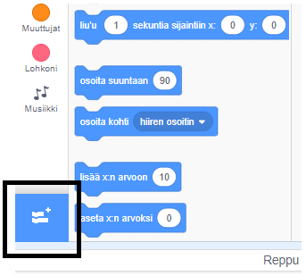
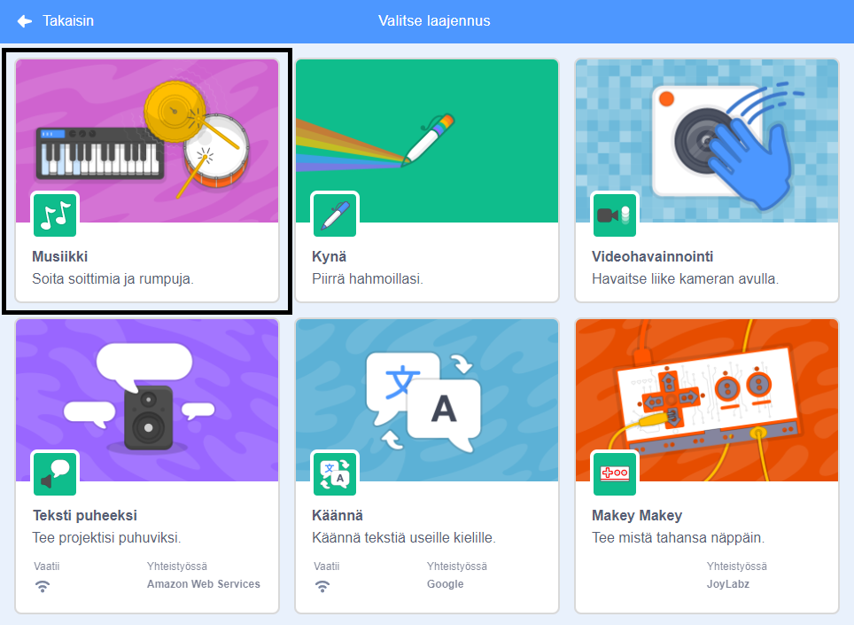
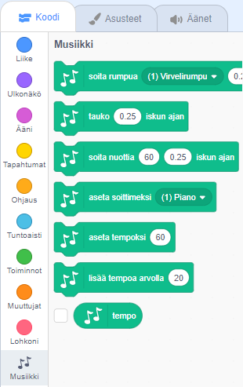

Jotta voit käyttää musiikkilohkoja Scratchissa, sinun on lisättävä **Musiikkilaajennus**.

+ Napsauta **Lisää laajennus** -painiketta vasemmassa alakulmassa.

+ Click on the **Music** extension to add it.

+ The Music section then appears at the bottom of the blocks menu.

