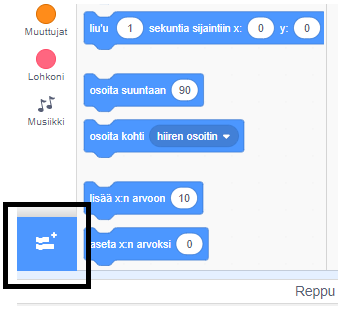
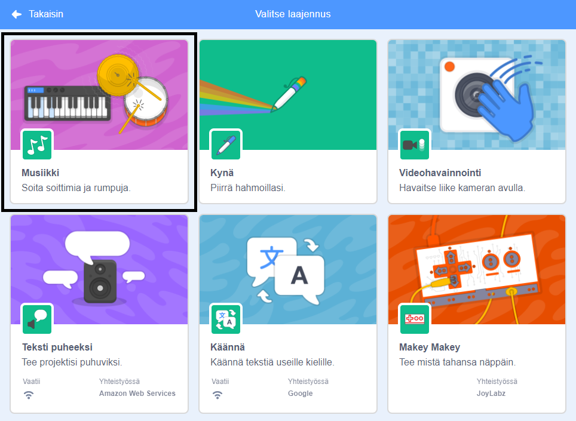
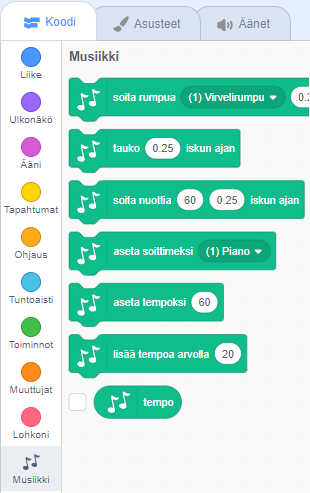

To use the Music blocks in Scratch, you need to add the **Music extension**.

+ Napsauta **Lisää laajennus** -painiketta vasemmassa alakulmassa.

+ Lisää laajennus napsauttamalla **Musiikki**.

+ Musiikkiosa tulee sitten esiin lohkovalikon alaosaan.

***
Tämän projektin ovat kääntäneet vapaaehtoiset:

[name]

[name]

[name]

Vapaaehtoisten ansiosta ihmisillä ympäri maailma on mahdollisuus oppia omalla kielellään. Voit auttaa meitä tavoittamaan enemmän ihmisiä vapaaehtoistyönä kääntämällä - lisätietoja osoitteessa [rpf.io/translate](rpf.io/translate).
