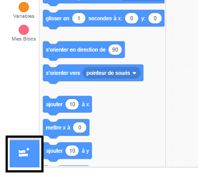
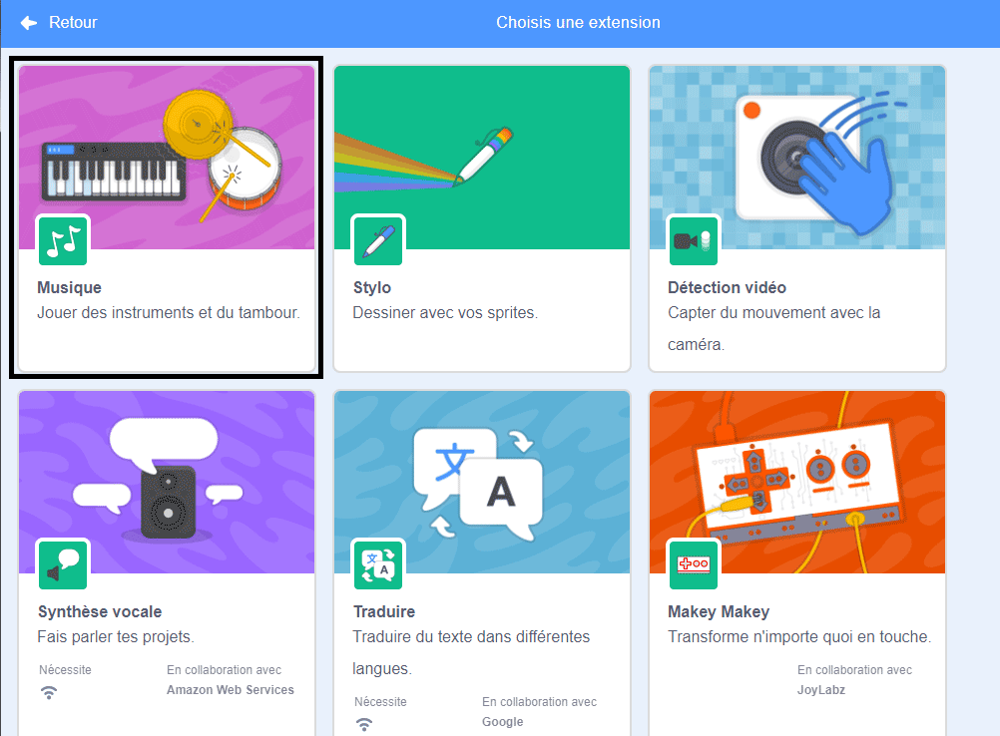
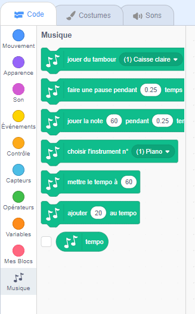

To use the Music blocks in Scratch, you need to add the **Music extension**.

+ Clique sur le bouton **Ajouter une extension** dans le coin en bas, à gauche.

+ Clique sur l'extension **Musique** pour l'ajouter.

+ La section Musique apparaît alors au bas du menu des blocs.

