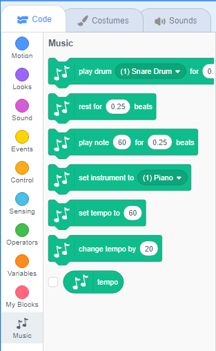

To use the Music blocks in Scratch, you need to add the **Music extension**.

+ नीचे बाएँ हाथ के कोने में **Add extension** पर क्लिक करें।

+ इसे जोड़ने के लिए **Music** एक्सटेंशन पर क्लिक करें।

+ Music खंड तब ब्लॉक्स मेनू के नीचे दिखाई देता है।

