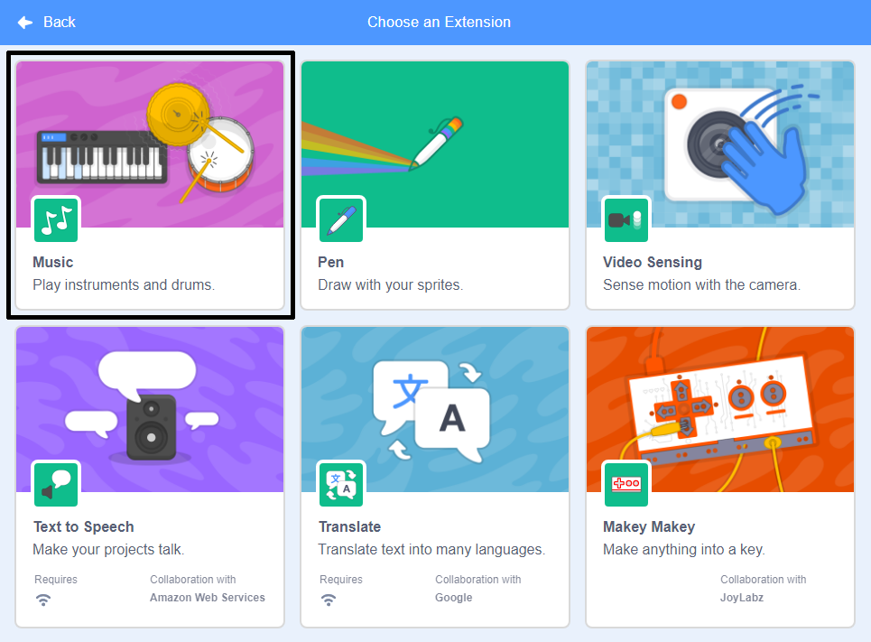

To use the Music blocks in Scratch, you need to add the **Music extension**.

+ नीचे बाएँ हाथ के कोने में **Add extension** पर क्लिक करें।

+ इसे जोड़ने के लिए **Music** एक्सटेंशन पर क्लिक करें।

+ Music खंड तब ब्लॉक्स मेनू के नीचे दिखाई देता है।

***
इस परियोजना का अनुवाद स्वयंसेवकों ने किया:

[name]

[name]

[name]

स्वयंसेवकों को धन्यवाद, हम दुनिया भर के लोगों को अपनी भाषा में सीखने का मौका दे सकते हैं। आप स्वेच्छा से अधिक लोगों तक पहुँचने में मदद कर सकते हैं - [rpf.io/translate](https://rpf.io/translate) पर अधिक जानकारी प्राप्त करें।
