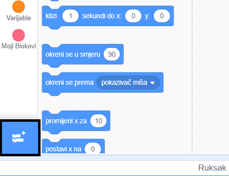
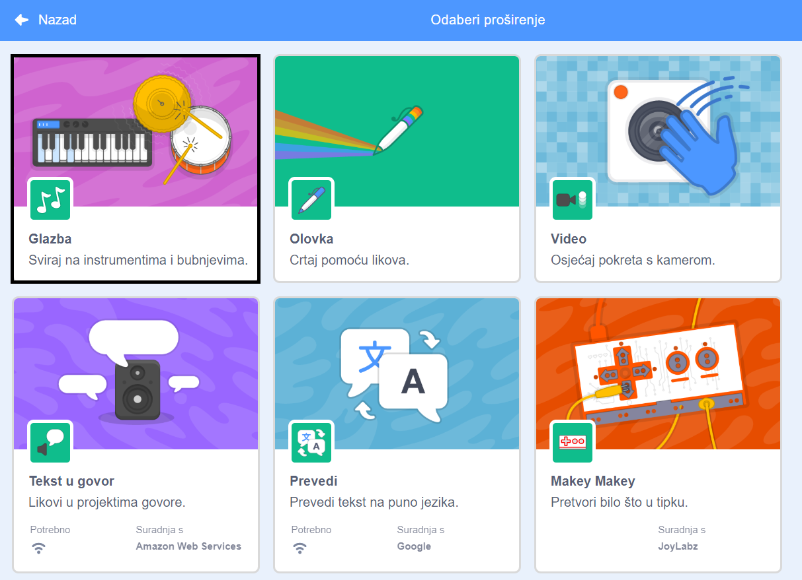
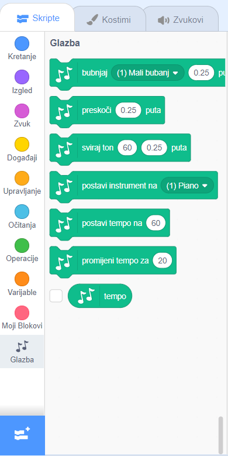

Za korištenje blokova kôda za glazbu u Scratchu, moraš dodati proširenje **Glazba**.

+ Klikni na gumb **Dodaj proširenje** u donjem lijevom kutu.

+ Klikni na proširenje **Glazba**.

+ Kategorija Glazba će se zatim pojaviti na dnu izbornika kategorija.

