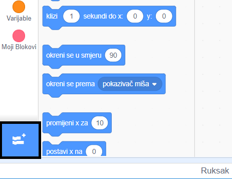

To use the Music blocks in Scratch, you need to add the **Music extension**.

+ Klikni na gumb **Dodaj proširenje** u donjem lijevom kutu.

+ Klikni na proširenje **Glazba**.

+ Kategorija Glazba će se zatim pojaviti na dnu izbornika kategorija.

***
Ovaj su projekt preveli volonteri:

[name]

[name]

[name]

Zahvaljujući volonterima, možemo pružiti ljudima širom svijeta priliku da uče na svom jeziku. Možete nam pomoći da dođemo do većeg broja ljudi tako da postanete volonter prevoditelj. Više informacija možete pronaći na [rpf.io/translate](https://rpf.io/translate).
