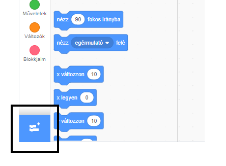
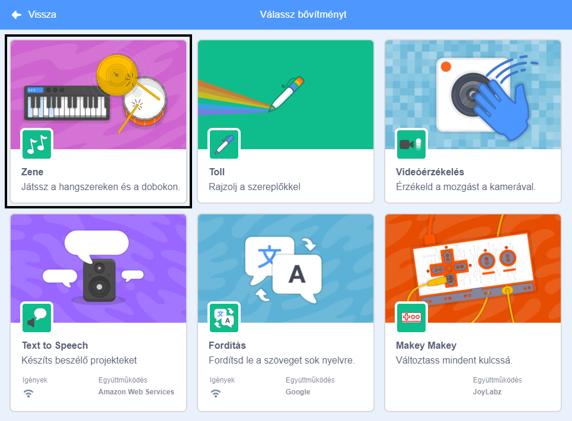
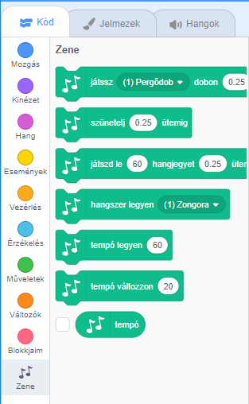

A Zene blokkok használatához a Scratchben hozzá kell adnod a **Zene bővítményt**.

+ Kattints a **Bővítmény hozzáadása** gombra a bal alsó sarokban.

+ Kattints a **Zene** bővítményre a hozzáadáshoz.

+ Ezután a Zene rész megjelenik a blokk menü alján.

