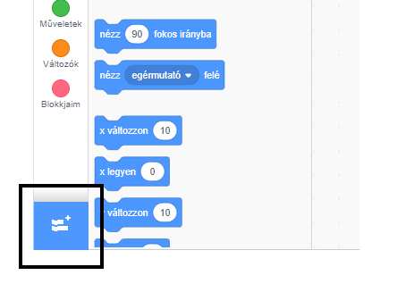
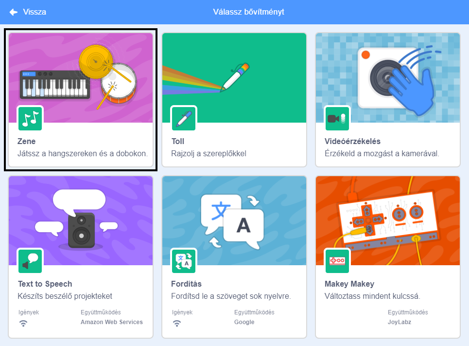
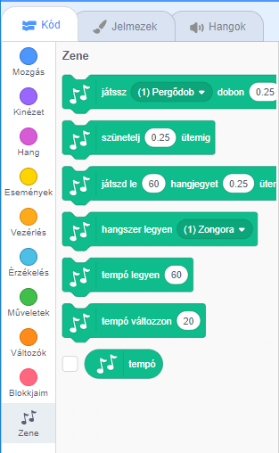

To use the Music blocks in Scratch, you need to add the **Music extension**.

+ Kattints a **Bővítmény hozzáadása** gombra a bal alsó sarokban.

+ Kattints a **Zene** bővítményre a hozzáadáshoz.

+ Ezután a Zene rész megjelenik a blokk menü alján.

***
A projektet önkéntesek fordították le:

[name]

[name]

[name]

Az önkénteseknek köszönhetően lehetőséget biztosítunk az embereknek a világ minden tájáról, hogy saját nyelvükön tanulhassanak. Segíthetsz minél több ember elérésében, ha önkéntesen részt veszel a fordításban - további információ az [rpf.io/translate](https://rpf.io/translate) oldalon.
