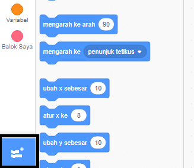
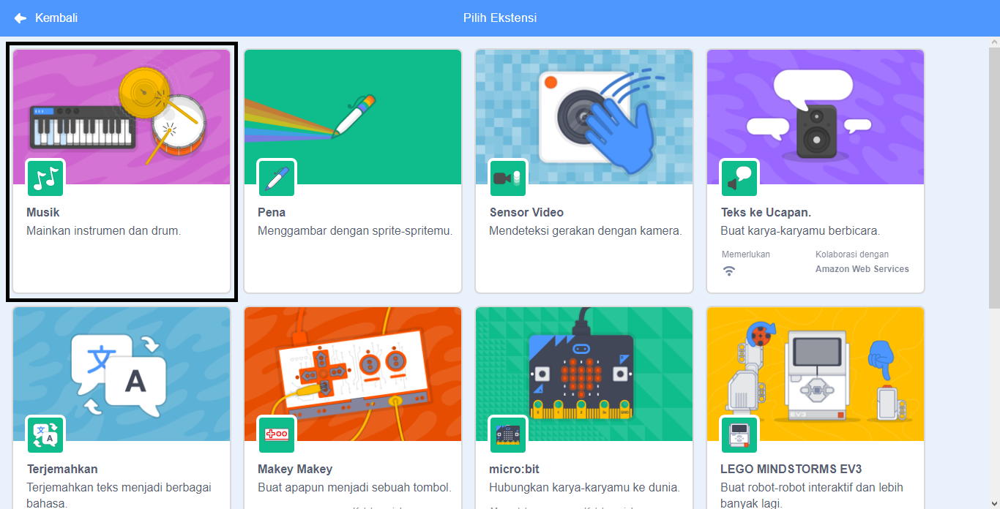
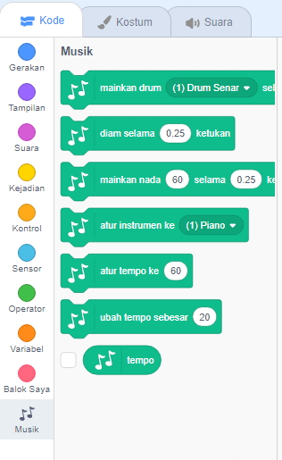

Untuk menggunakan blok Musik dalam Scratch, kamu perlu menambahkan **Ekstensi Musik**.

+ Klik tombol **tambahkan ekstensi** dibagian sudut kiri bawahmu.

+ Klik pada ekstensi **Musik** untuk menambahkannya.

+ Bagian Musik akan muncul di bagian bawah menu blok.

