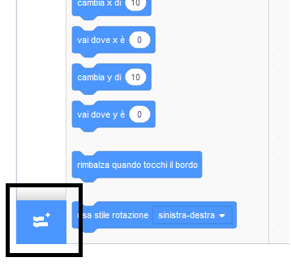
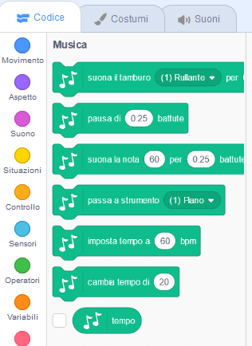

To use the Music blocks in Scratch, you need to add the **Music extension**.

+ Fai clic su **Aggiungi estensione** nell'angolo in basso a sinistra.

+ Clicca sull'estensione **Musica** per aggiungerla.

+ La sezione Musica apparirà in fondo al menu dei blocchi.

