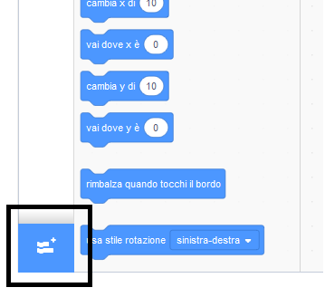

To use the Music blocks in Scratch, you need to add the **Music extension**.

+ Fai clic su **Aggiungi estensione** nell'angolo in basso a sinistra.

+ Clicca sull'estensione **Musica** per aggiungerla.

+ La sezione Musica apparirà in fondo al menu dei blocchi.

***
Questo progetto è stato tradotto da volontari:

[name]

[name]

[name]

Grazie ai volontari, possiamo offrire alle persone di tutto il mondo la possibilità di imparare nella loro lingua. Puoi aiutarci a raggiungere più persone offrendoti come volontario per la traduzione - puoi trovare maggiori informazioni su [rpf.io/translate](https://rpf.io/translate).
