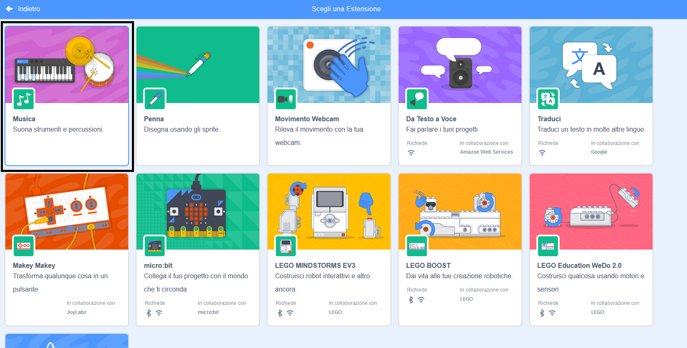

Per usare i blocchi Musica in Scratch, devi aggiungere **l'estensione Musica**.

+ Fai clic su **Aggiungi estensione** nell'angolo in basso a sinistra.

+ Clicca sull'estensione **Musica** per aggiungerla.

+ La sezione Musica apparirà in fondo al menu dei blocchi.

