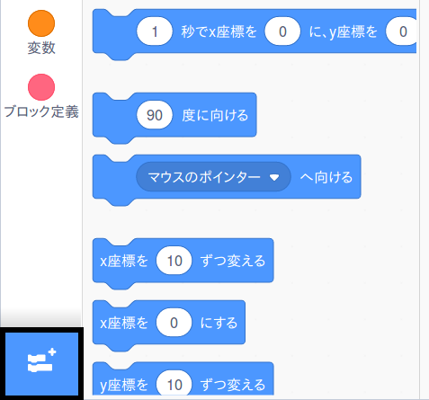

To use the Music blocks in Scratch, you need to add the **Music extension**.

+ 左下隅にある[ **拡張機能を追加**] ボタンをクリックします。

+ **音楽** 拡張機能をクリックして追加します。

+ 音楽セクションがブロックメニューの下の方に追加されます。

***
このプロジェクトは以下のボランティアによって翻訳されました。

[name]

[name]

[name]

ボランティアのおかげで、世界中の人々に母国語で学ぶ機会を与えることができます。翻訳を引き受けていただくことで、より多くの人々に手を差し伸べることができます。詳しくは [rpf.io/translate](https://rpf.io/translate) をご覧ください。
