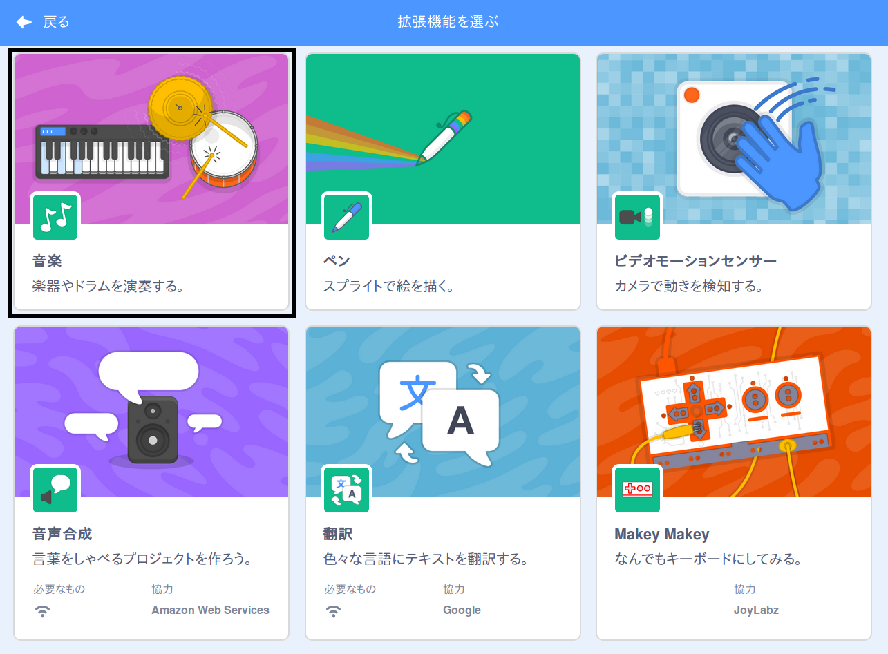

Scratchで音楽ブロックを使用するには、 **音楽拡張機能**を追加する必要があります。

+ 左下隅にある[ **拡張機能を追加**] ボタンをクリックします。

+ Click on the **Music** extension to add it.

+ The Music section then appears at the bottom of the blocks menu.

