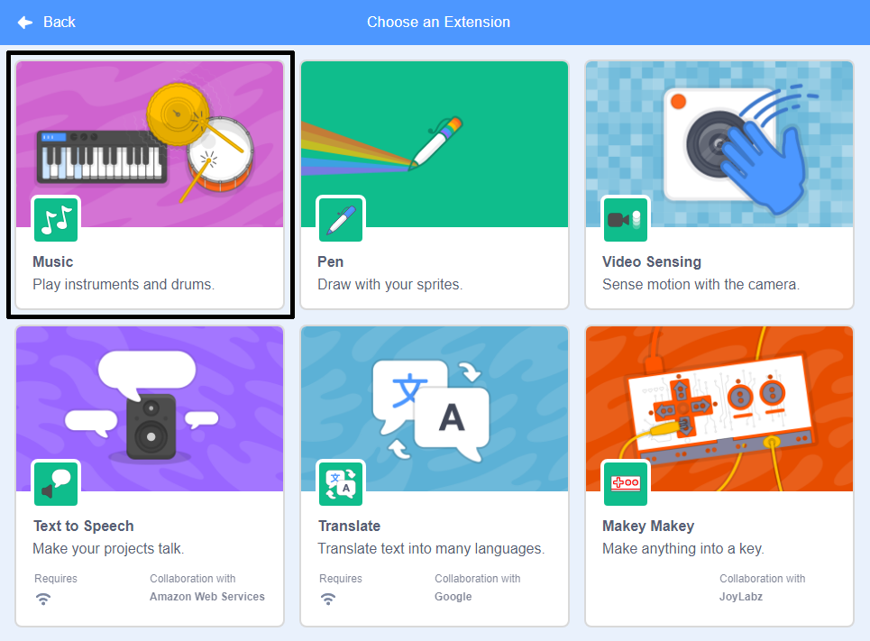

Scratch ‌ನಲ್ಲಿ Music ಬ್ಲಾಕ್‌ಗಳನ್ನು ಬಳಸಲು, ನೀವು **Music extension** ಸೇರಿಸಬೇಕು.

+ ಕೆಳ ಎಡ ಮೂಲೆಯಲ್ಲಿರುವ **Add extension** ಬಟನ್ ಮೇಲೆ ಕ್ಲಿಕ್ ಮಾಡಿ.

+ ಅದನ್ನು ಸೇರಿಸಲು **Music** ವಿಸ್ತರಣೆಯ ಮೇಲೆ ಕ್ಲಿಕ್‌ ಮಾಡಿ.

+ Music ವಿಭಾಗವು ಆಗ ಬ್ಲಾಕ್‌ಗಳ ಮೆನುನ ಕೆಳಭಾಗದಲ್ಲಿ ಕಾಣಿಸಿಕೊಳ್ಳುತ್ತದೆ.

