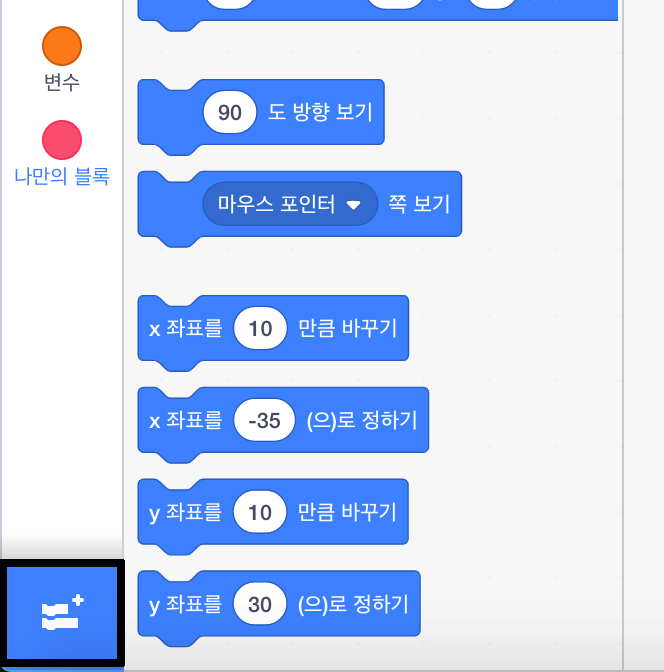

To use the Music blocks in Scratch, you need to add the **Music extension**.

+ 왼쪽 하단에 **추가 확장** 버튼을 클릭 하십시오.

+ **음악** 을 클릭하면 음악 확장 기능을 추가할 수 있습니다.

+ 음악 섹션이 블록 메뉴 하단에 나타납니다.

***
이 프로젝트는 아래 자원 봉사자들에 의해 번역되었습니다:

[name]

[name]

[name]

번역 봉사자들 덕분에 우리는 전 세계 사람들에게 프로그래밍을 모국어로 배울 수 있는 기회를 제공하고 있습니다. 번역 봉사에 동참해서 더 많은 사람들에게 프로그래밍을 배울 수 있는 기회를 제공하세요 - [rpf.io/translate](https://rpf.io/translate)에서 더 많은 정보를 확인하세요.
