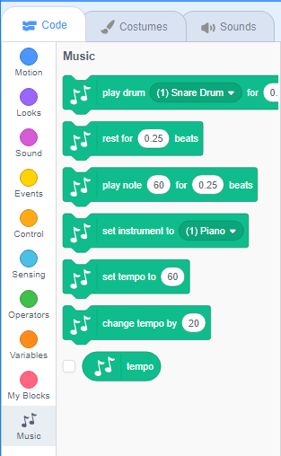

To use the Music blocks in Scratch, you need to add the **Music extension**.

+ तळाशी डाव्या हाताच्या कोपर्यात **Add extension** बटन क्लिक करा.

+ जोडण्यासाठी **Music** विस्तारावर क्लिक करा.

+ नंतर Music विभाग, ब्लॉक मेनूच्या तळाशी दिसून येतो.

