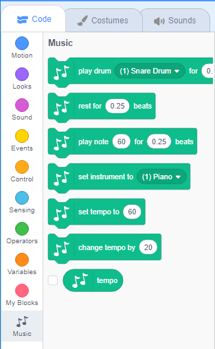

To use the Music blocks in Scratch, you need add the **Music extension**.

+ Click on the **Add extension** button in the bottom left-hand corner.

+ Click on the **Music** extension to add it.

+ The Music section then appears at the bottom of the blocks menu.

