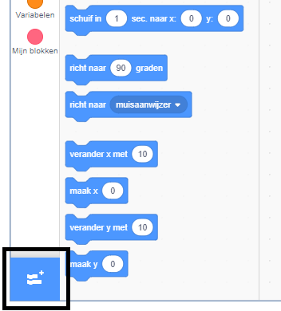
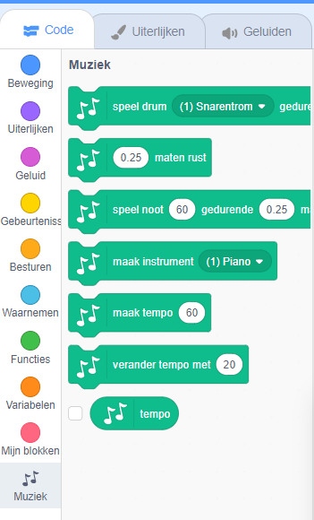

To use the Music blocks in Scratch, you need to add the **Music extension**.

+ Klik op de knop **Voeg een uitbreiding toe** in de linkerbenedenhoek.

+ Klik op de **Muziek**-uitbreiding om deze toe te voegen.

+ Het Muziek-gedeelte verschijnt vervolgens onder aan het menu Blokken.

