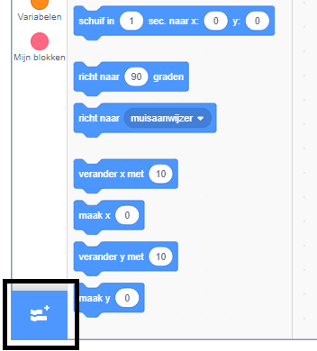
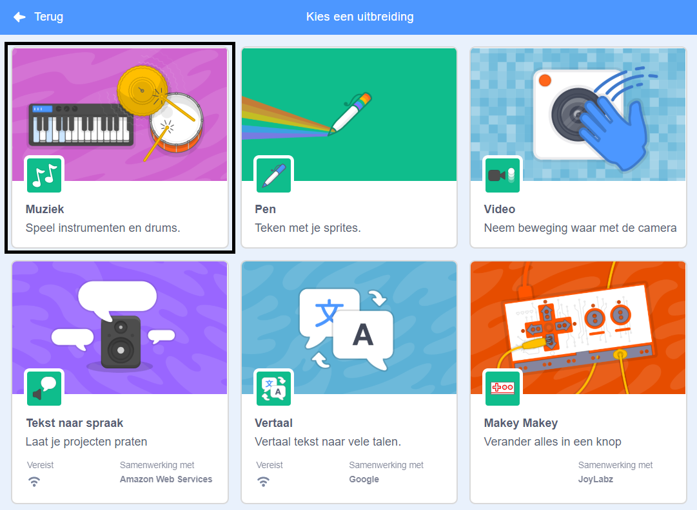

To use the Music blocks in Scratch, you need to add the **Music extension**.

+ Klik op de knop **Voeg een uitbreiding toe** in de linkerbenedenhoek.

+ Klik op de **Muziek**-uitbreiding om deze toe te voegen.

+ Het Muziek-gedeelte verschijnt vervolgens onder aan het menu Blokken.

***
Dit project werd vertaald door vrijwilligers:

[name]

[name]

[name]

Dankzij vrijwilligers kunnen we mensen over de hele wereld de kans geven om in hun eigen taal te leren. Jij kunt ons helpen meer mensen te bereiken door vrijwillig te starten met vertalen - meer informatie op [rpf.io/translate](https://rpf.io/translate).
