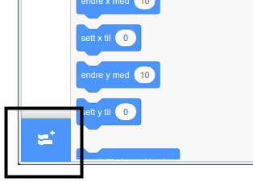
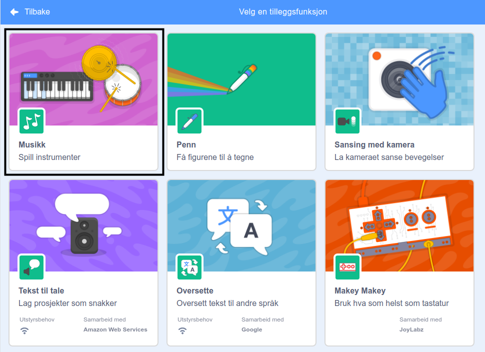
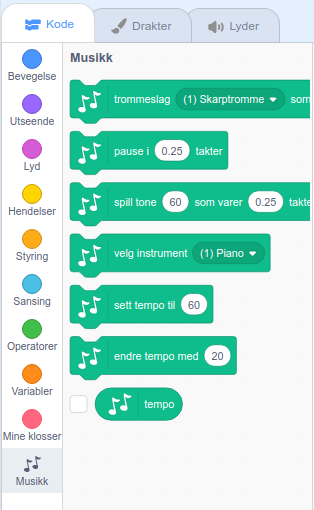

For å bruke musikkblokkene i Scratch, må du legge til **musikkutvidelsen**.

+ Klikk på **Hent tilleggsfunksjon**-knappen i nedre venstre hjørne.

+ Klikk på **Musikk**-utvidelsen for å legge den til.

+ Musikk-delen vises deretter nederst på blokk-menyen.

