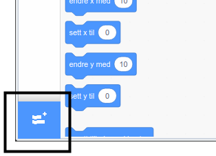

To use the Music blocks in Scratch, you need to add the **Music extension**.

+ Klikk på **Hent tilleggsfunksjon**-knappen i nedre venstre hjørne.

+ Klikk på **Musikk**-utvidelsen for å legge den til.

+ Musikk-delen vises deretter nederst på blokk-menyen.

***
Dette prosjektet er oversatt av frivillige:

[name]

[name]

[name]

Takket være frivillige kan vi gi mennesker over hele verden sjansen til å lære på sitt eget språk. Du kan hjelpe oss med å nå flere mennesker ved å melde deg frivillig til å oversette - mer informasjon på [rpf.io/translate](rpf.io/translate).
