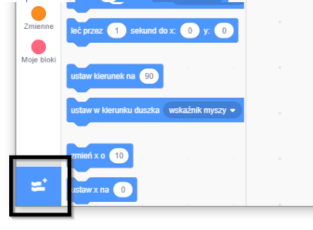
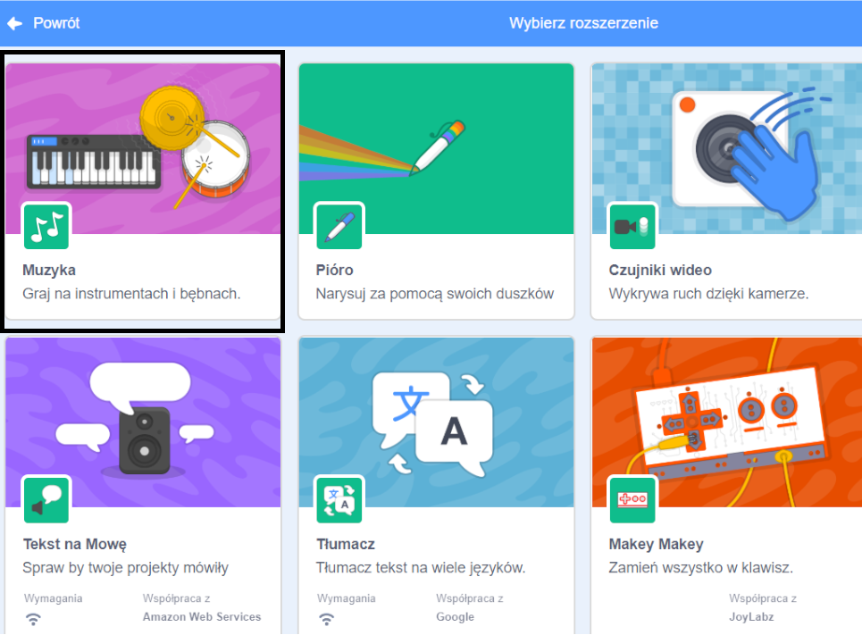
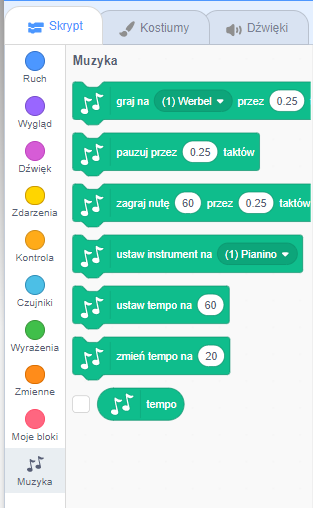

Aby używać bloków Muzyki w Scratch, musisz dodać **rozszerzenie Muzyka**.

+ Kliknij na przycisk **Dodaj rozszerzenie** w lewym dolnym rogu.

+ Kliknij na opcję **Muzyka**, żeby dodać to rozszerzenie.

+ Sekcja Muzyka pojawi się na dole menu bloków.

