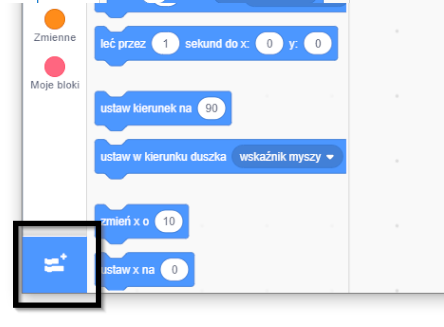

To use the Music blocks in Scratch, you need to add the **Music extension**.

+ Kliknij na przycisk **Dodaj rozszerzenie** w lewym dolnym rogu.

+ Kliknij na opcję **Muzyka**, żeby dodać to rozszerzenie.

+ Sekcja Muzyka pojawi się na dole menu bloków.

***
Ten projekt został przetłumaczony przez wolontariuszy:

[name]

[name]

[name]

Dzięki wolontariuszom możemy dać ludziom na całym świecie szansę nauki w ich własnym języku. Możesz pomóc nam dotrzeć do większej liczby osób, zgłaszając się na ochotnika do tłumaczenia - więcej informacji na stronie [rpf.io/translate](https://rpf.io/translate).
