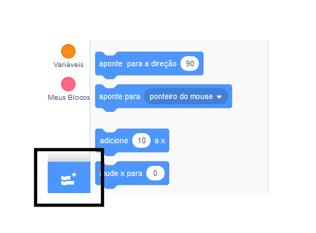
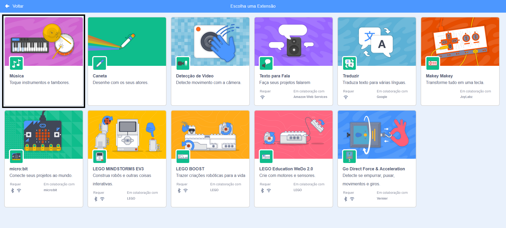
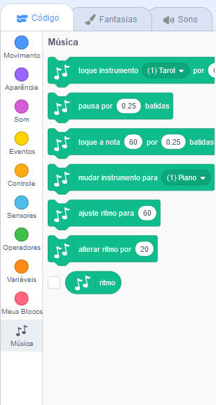

Para usar os blocos de música no Scratch, você precisa adicionar a extensão **Música**.

+ Clique no botão **Adicionar extensão** no canto inferior esquerdo.

+ Clique na extensão **Música** para adicioná-la.

+ A seção Música aparece na parte inferior do menu de blocos.

