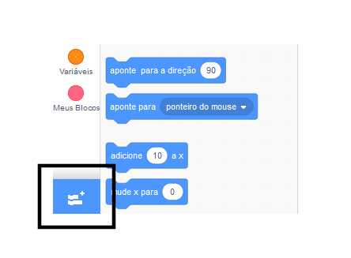

To use the Music blocks in Scratch, you need to add the **Music extension**.

+ Clique no botão **Adicionar extensão** no canto inferior esquerdo.

+ Clique na extensão **Música** para adicioná-la.

+ A seção Música aparece na parte inferior do menu de blocos.

***
Este projeto foi traduzido por voluntários:

[name]

[name]

[name]

Graças a voluntários, podemos dar às pessoas de todo o mundo a chance de aprender em seu próprio idioma. Você pode nos ajudar a alcançar mais pessoas oferecendo-se para traduzir - mais informações em [rpf.io/translate](https://rpf.io/translate).
