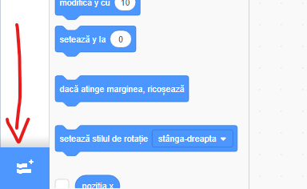
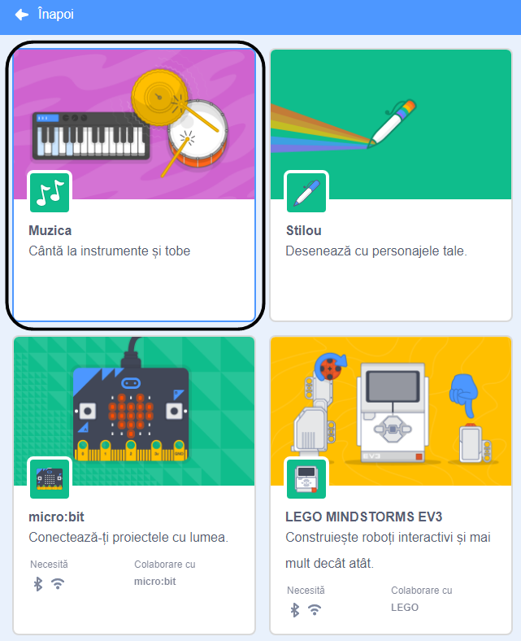
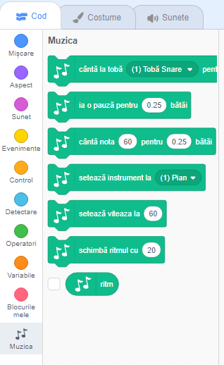

To use the Music blocks in Scratch, you need to add the **Music extension**.

+ Dă click pe butonul **Adaugă o extensie** în colțul din stânga jos.

+ Dă click pe extensia **Muzica** pentru a o adăuga.

+ Secțiunea Muzica va apărea apoi în partea de jos a meniului blocurilor.

