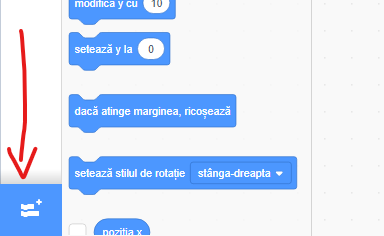

To use the Music blocks in Scratch, you need to add the **Music extension**.

+ Dă click pe butonul **Adaugă o extensie** în colțul din stânga jos.

+ Dă click pe extensia **Muzica** pentru a o adăuga.

+ Secțiunea Muzica va apărea apoi în partea de jos a meniului blocurilor.

***
Acest proiect a fost tradus de voluntarii:

[name]

[name]

[name]

Datorită voluntarilor, putem oferi oamenilor din întreaga lume șansa de a învăța în propria lor limbă. Ne poți ajuta să ajungem la mai multe persoane, ajutând la traducere ca și voluntar - mai multe informații la [rpf.io/translate](https://rpf.io/translate).
