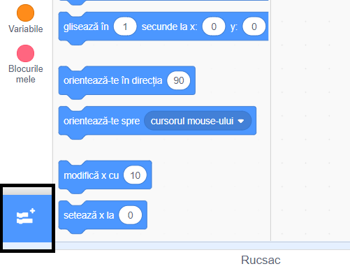

Pentru a utiliza blocurile Muzică în Scratch, trebuie să adaugi **extensia Muzică**.

+ Dă click pe butonul **Adaugă o extensie** în colțul din stânga jos.

+ Dă click pe extensia **Muzica** pentru a o adăuga.

+ Secțiunea Muzica va apărea apoi în partea de jos a meniului blocurilor.

