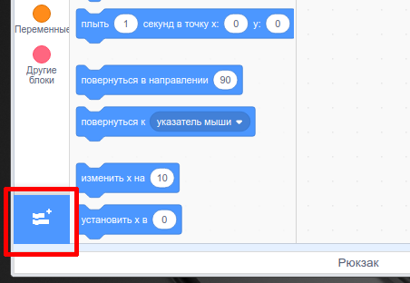
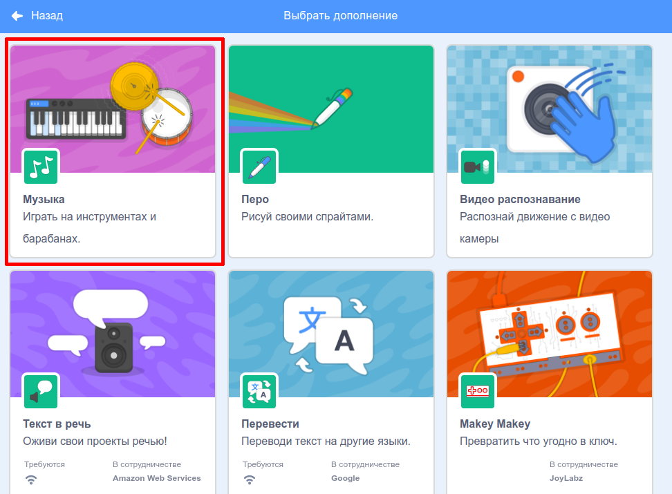
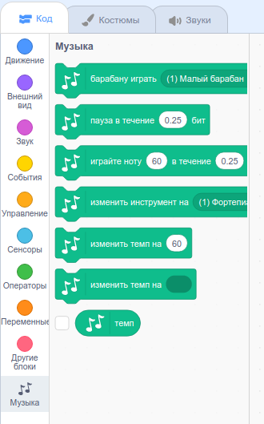

Чтобы использовать блоки Музыки в Scratch, тебе нужно добавить расширение **Музыка**.

+ Нажми кнопку **Добавить расширение** в левом нижнем углу.

+ Нажми на расширение **Музыка**, чтобы добавить его.

+ Раздел «Музыка» появится в меню блоков внизу.

