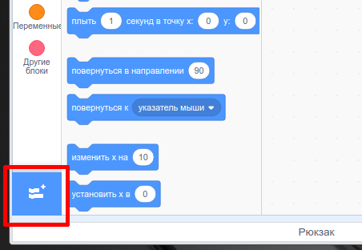
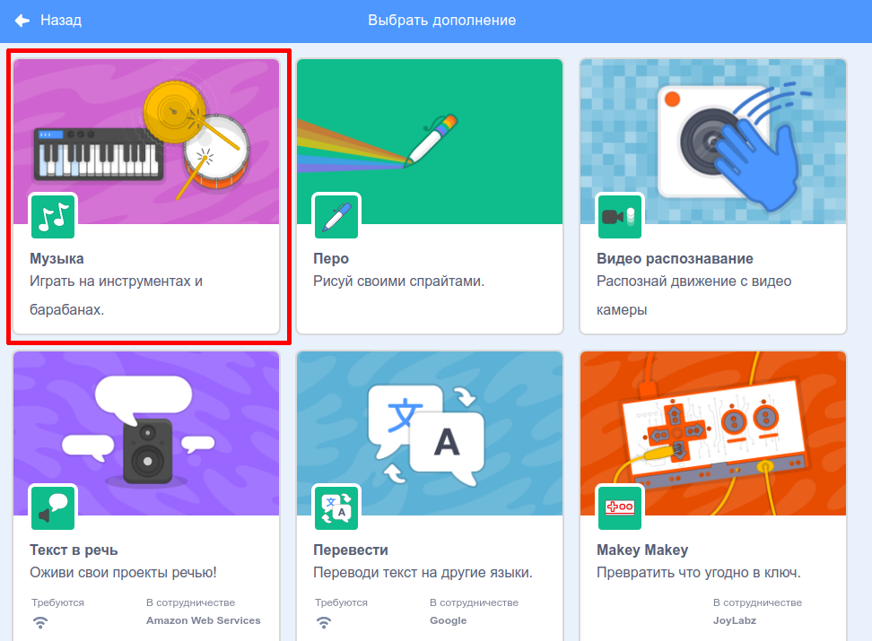
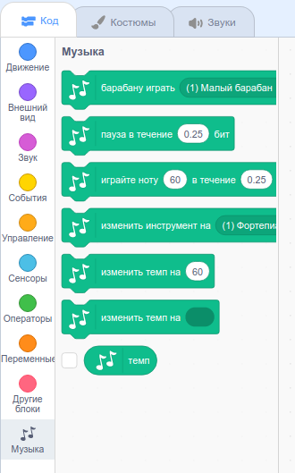

To use the Music blocks in Scratch, you need to add the **Music extension**.

+ Нажми кнопку **Добавить расширение** в левом нижнем углу.

+ Нажми на расширение **Музыка**, чтобы добавить его.

+ Раздел «Музыка» появится в меню блоков внизу.

***
Этот проект был переведен волонтерами:

[name]

[name]

[name]

Благодаря волонтерам мы можем дать возможность людям во всем мире учиться на их родном языке. Вы можете помочь нам привлечь больше волонтёров-переводчиков - подробнее на [rpf.io/translate](https://rpf.io/translate).
