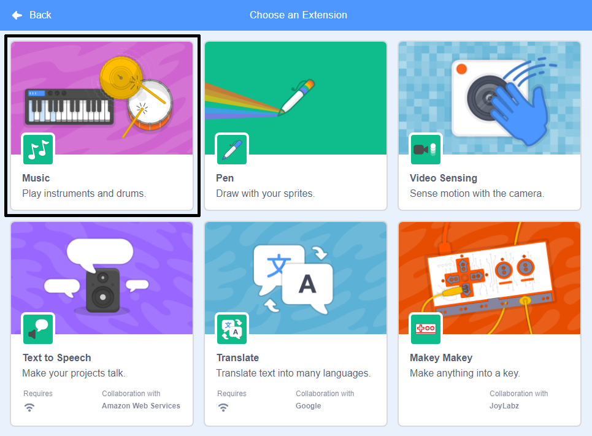

Scratch වල සංගීත කට්ටි(Music Blocks) භාවිතා කිරීමට, ඔබ **සංගීත දිගු(Music extension)** එකතු කරගත යුතුය.

+ පහළ වම් කෙළවරේ ඇති **දිගුවක් එක්කිරීම(Add extension)** බොත්තම ක්ලික් කරන්න.

+ එක් කිරීමට **සංගීත(Music)** දිගුව(extension) මත ක්ලික් කරන්න.

+ සංගීත කොටස (Music section) පසුව බ්ලොක් මෙනුවේ (blocks menu) පතුලේ දිස් වේ.

