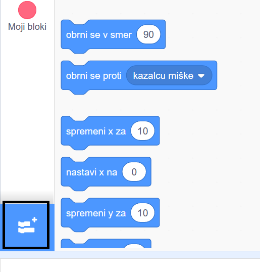
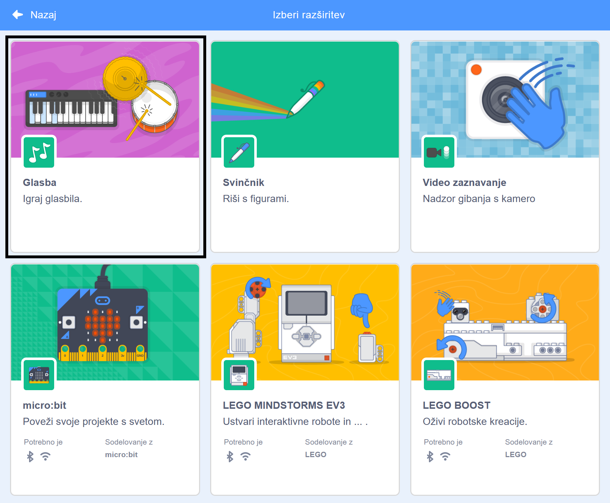
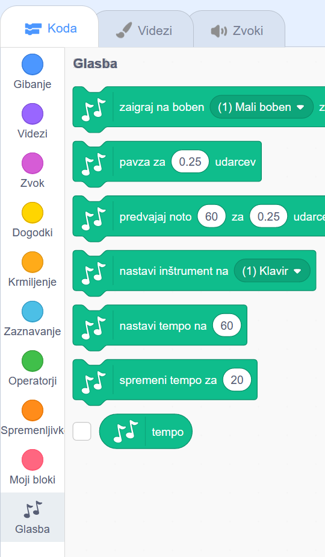

Za uporabo Glasbenih blokov v Scratchu, moraš dodati **razširitev Glasba**.

+ V spodnjem levem kotu klikni gumb **Dodaj razširitev**.

+ Za dodajanje klikni na razširitev **Glasba**.

+ Nato se na dnu menija blokov prikaže oddelek Glasba.

