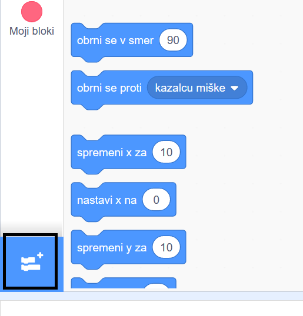

To use the Music blocks in Scratch, you need to add the **Music extension**.

+ V spodnjem levem kotu klikni gumb **Dodaj razširitev**.

+ Za dodajanje klikni na razširitev **Glasba**.

+ Nato se na dnu menija blokov prikaže oddelek Glasba.

***
Ta projekt so prevedli prostovoljci:

[name]

[name]

[name]

Zahvaljujoč prostovoljcem, lahko ljudem po vsem svetu omogočimo, da se učijo v svojem jeziku. S prostovoljnim prevajanjem nam lahko pomagate, da dosežemo več ljudi - več informacij na [rpf.io/translate](https://rpf.io/translate).
