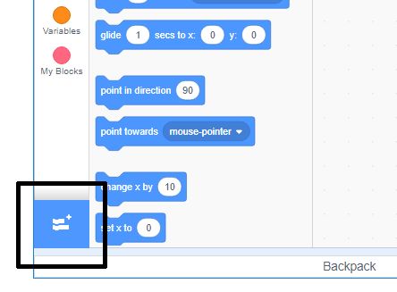

To use the Music blocks in Scratch, you need to add the **Music extension**.

+ దిగువ ఎడమవైపు మూలలో ఉన్న **Add extension** ని జోడించు బటన్‌పై క్లిక్ చేయండి.

+ దీన్ని జోడించడానికి **Music** పొడిగింపుపై క్లిక్ చేయండి.

+ Music విభాగం బ్లాక్స్ మెను దిగువన కనిపిస్తుంది.

