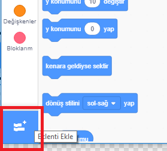
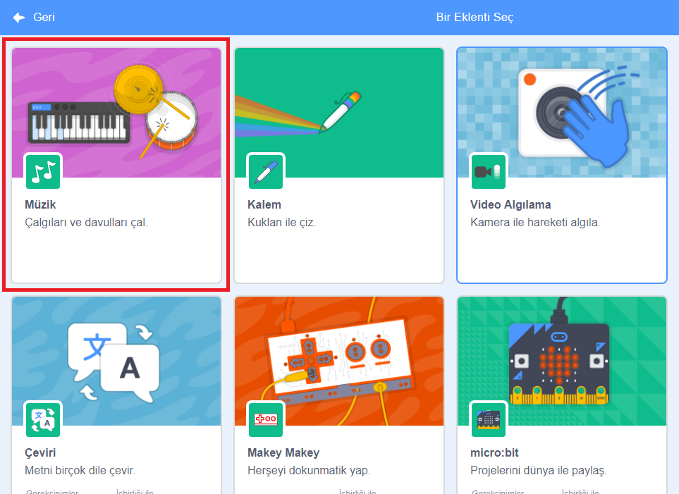
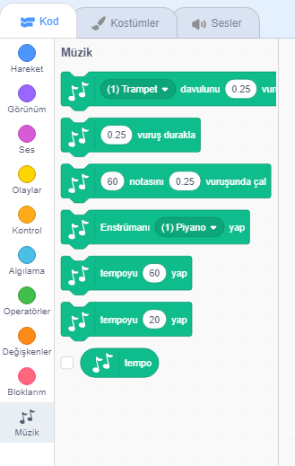

To use the Music blocks in Scratch, you need to add the **Music extension**.

+ Sol alt köşedeki **Eklenti Ekle** düğmesine tıklayın.

+ Eklemek için **Müzik** uzantısına tıklayın.

+ Müzik bölümü daha sonra bloklar menüsünün altında görünür.

