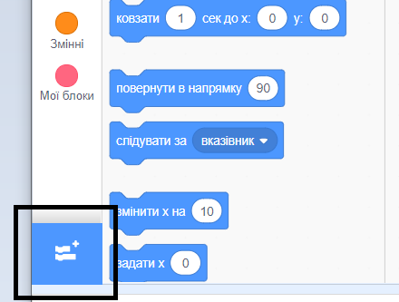

Для використання блоків Музика у Скретч потрібно додати розширення **Музика**.

+ Натисни на кнопку **Додати розширення** у лівому нижньому куті.

+ Натисни на розширення **Музика**, щоб додати його.

+ Розділ Музика з’явиться у меню блоків знизу.

