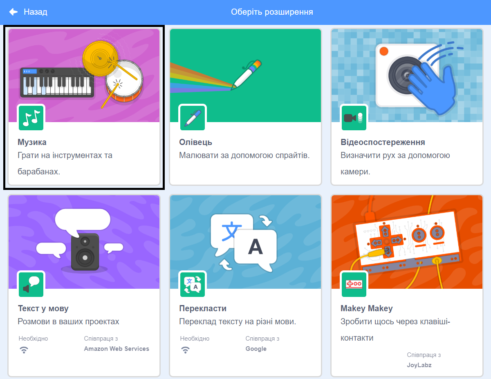
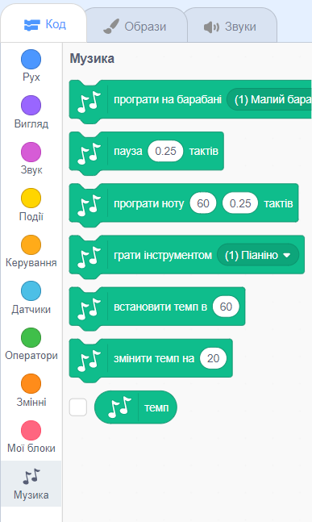

Для використання блоків Музика у Scratch потрібно додати розширення **Музика**.

+ Натисніть на кнопку **Додати розширення** у лівому нижньому куті.

+ Натисніть на розширення **Музика**, щоб додати його.

+ Розділ Музика з’явиться у меню блоків знизу.

