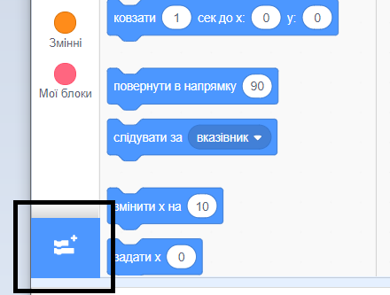
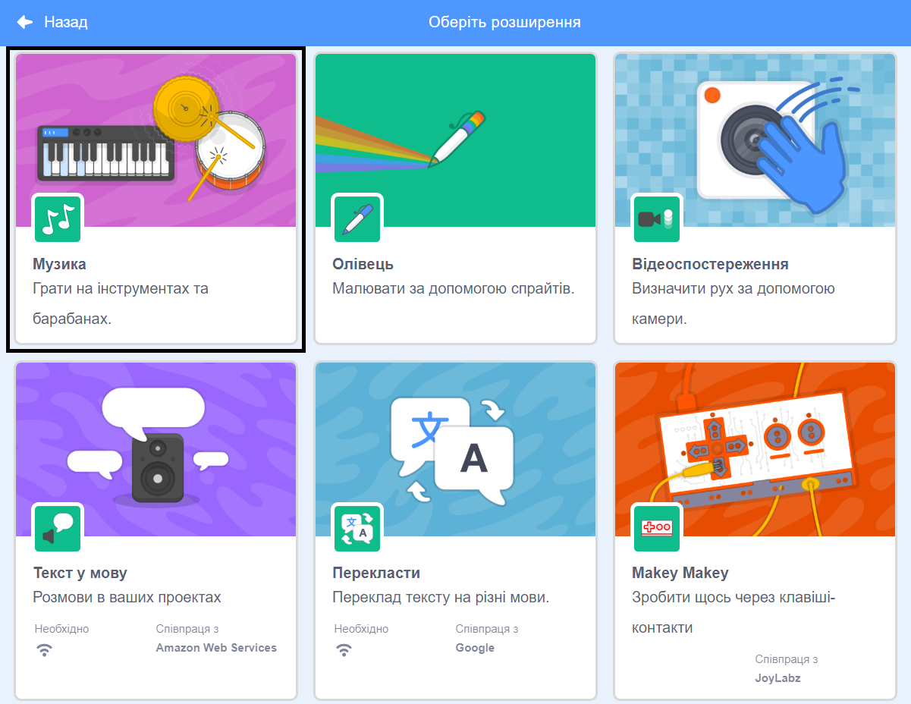

Для використання блоків Музики у Scratch, потрібно додати розширення **Музика**.

+ Натисни на кнопку **Додати розширення** у лівому нижньому куті.

+ Натисни на розширення **Музика**, щоб додати його.

+ Розділ Музика з’явиться у меню блоків знизу.

***
Цей проєкт переклали волонтери:

[name]

[name]

[name]

Завдяки волонтерам ми надаємо можливість людям у всьому світі навчатися рідною мовою. Ви також можете допомогти нам у цьому — більше інформації про волонтерську програму на [rpf.io/translate](https://rpf.io/translate).
